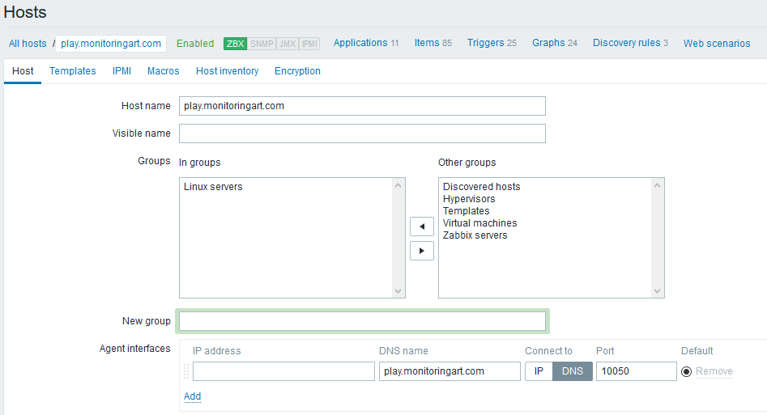
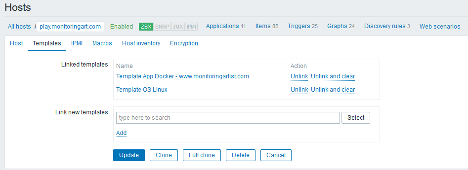

# Docker Agent - Dockerized Zabbix Agent with Docker, host, systemd, sockets monitoring

[](https://hub.docker.com/r/monitoringartist/dockbix-agent-xxl-limited/)
[](https://github.com/monitoringartist/dockbix-agent-xxl)
[](https://hub.docker.com/r/monitoringartist/dockbix-agent-xxl-limited/)
[](https://hub.docker.com/r/monitoringartist/dockbix-agent-xxl-limited/)
[](https://store.docker.com/images/d01b16a8-596b-4e30-8892-7cd64781ca98)
[](http://www.monitoringartist.com 'DevOps / Docker / Kubernetes / AWS ECS / Google GCP / Zabbix / Zenoss / Terraform / Monitoring')

----

- **[Docker] (https://hub.docker.com/r/monitoringartist/dockbix-xxl/)** - Zabbix server/proxy/UI/snmpd/java gateway with additional extensions
- **[Docker agent](https://hub.docker.com/r/monitoringartist/dockbix-agent-xxl-limited/)** - Zabbix agent with [Docker (Kubernetes/Mesos/Chronos/Marathon) monitoring](https://github.com/monitoringartist/zabbix-docker-monitoring) module
- **[Zabbix templates](https://hub.docker.com/r/monitoringartist/zabbix-templates/)** - tiny Docker image for simple template deployment of selected Zabbix monitoring templates
- **[Zabbix extension - all templates](https://hub.docker.com/r/monitoringartist/zabbix-ext-all-templates/)** - storage image for Docker agent with 200+ [community templates](https://github.com/monitoringartist/zabbix-community-repos)
- **[Kubernetized Zabbix](https://github.com/monitoringartist/kubernetes-zabbix)** - containerized Zabbix cluster based on Kubernetes
- **[Grafana](https://hub.docker.com/r/monitoringartist/grafana-xxl/)** - dockerized Grafana with all community plugins
- **[Grafana dashboards](https://grafana.net/monitoringartist)** - Grafana dashboard collection for [AWS](https://github.com/monitoringartist/grafana-aws-cloudwatch-dashboards) and [Zabbix](https://github.com/monitoringartist/grafana-zabbix-dashboards)
- **[Monitoring Analytics](https://hub.docker.com/r/monitoringartist/monitoring-analytics/)** - graphic analytic tool for Zabbix data from data scientists
- **[Docker killer](https://hub.docker.com/r/monitoringartist/docker-killer/)** - Docker image for Docker stress and Docker orchestration testing

----

Start Docker agent container and monitor all Docker containers on your host.
Module [Zabbix Docker monitoring](https://github.com/monitoringartist/zabbix-docker-monitoring)
is used - all [docker module container metrics](https://github.com/monitoringartist/zabbix-docker-monitoring)
are available except `docker.xnet`. Import/assign [Docker Agent templates](https://raw.githubusercontent.com/monitoringartist/dockbix-agent-xxl/master/Zabbix-Templates-for-Dockbix-Agent-XXL.xml) +
then just start Docker agent container:


```bash
docker run \
  --name=docker-agent \
  --net=host \
  --privileged \
  -v /:/rootfs \
  -v /var/run:/var/run \
  --restart unless-stopped \
  -e "ZA_Server=<ZABBIX SERVER IP/DNS NAME/IP_RANGE>" \
  -e "ZA_ServerActive=<ZABBIX SERVER IP/DNS NAME>" \
  -d monitoringartist/dockbix-agent-xxl-limited:latest
```


```bash
docker run --rm -t monitoringartist/dockbix-agent-xxl-limited version
```

Please donate to the author, so he can continue to publish other awesome
projects for free:

[](https://www.paypal.com/cgi-bin/webscr?cmd=_s-xclick&hosted_button_id=8LB6J222WRUZ4)

# Available tags

| Docker image tag | Docker image description |
| ---------------- | ------------------------ |
| latest<br/>3.4-3 | **Recommended version**<br/>Zabbix 3.4 agent + Dockbix v3 |
| 3.2-2 | Zabbix 3.2 agent + Dockbix v2 |
| 3.2-1 | Zabbix 3.2 agent + Dockbix v1 |

[Public image tags on Docker Hub](https://hub.docker.com/r/monitoringartist/dockbix-agent-xxl-limited/tags/) | [Private image tags on Docker Hub](https://hub.docker.com/r/monitoringartist/dockbix-agent-xxl/tags/)

# Public limited vs private paid image

Public limited Docker image `monitoringartist/dockbix-agent-xxl-limited:latest`
has almost the same functionality as private paid Docker image
`monitoringartist/dockbix-agent-xxl:latest`. However, limited version:

- doesn't support custom UserParameter(s)
- doesn't support command execution in the container; for example, you can't
use `system.run[]` item
- doesn't support any shell access in the container; for example, you can't
use `docker exec -ti docker-agent bash`
- collects Google Analytics statistics (Docker version, kernel version, execution driver,
Docker agent container start-up errors), which are used for improvements;
statistics may also be used for public presentations

[](https://monitoringartist.com/product/private-docker-image-dockbix-agent-xxl/)

General limitations:

- Docker agent container doesn't support `docker stop/start` container commands
- Docker agent container doesn't support `docker.xnet` container metrics
- host metric support is not complete; CPU and net host metrics are available, filesystem metrics with `/rootfs` prefix, process (`proc.*`) are not available due to cgroup limitation

# Environment configuration variables

You can use almost any [agent config parameter](https://www.zabbix.com/documentation/3.2/manual/appendix/config/zabbix_agentd),
just add prefix `ZA_`. If you don't specify a custom setting variable, then default
Zabbix agent setting will be used. For example, you want to use `StartAgents=10`,
just add environment variable `-e "ZA_StartAgents=10"`.

Example:

```bash
docker run \
  --name=docker-agent-xxl \
  --net=host \
  --privileged \
  -v /:/rootfs \
  -v /var/run:/var/run \
  --restart unless-stopped \
  -e "ZA_Server=<ZABBIX SERVER IP/DNS NAME/IP RANGE>" \
  -e "ZA_ServerActive=<ZABBIX SERVER IP/DNS NAME>" \
  -e "ZA_StartAgents=10" \
  -e "ZA_Timeout=30" \
  -d monitoringartist/dockbix-agent-xxl-limited:latest
```

You can't override some parameters: `AllowRoot, LoadModulePath, LoadModule,
LogType`, because Docker monitoring module is used. Also, Zabbix agent
configuration from the config file is not supported.

# Zabbix templates

Example of Zabbix templates, which can be used with Docker agent:

- [Templates for Docker Agent](https://raw.githubusercontent.com/monitoringartist/dockbix-agent-xxl/master/Zabbix-Templates-for-Dockbix-Agent-XXL.xml) -
  discovers and monitors (some) host and Docker metrics
- [Templates App systemd services](https://raw.githubusercontent.com/cavaliercoder/zabbix-module-systemd/master/templates/Template%20App%20systemd%20services.xml) -
  discovers and monitors systemd services metrics
- [Template App TCP Sockets](https://raw.githubusercontent.com/cavaliercoder/zabbix-module-sockets/master/templates/Template_App_TCP_Sockets_3.2.xml) -
  monitors TCP socket metrics
- [Template App UDP Sockets](https://raw.githubusercontent.com/cavaliercoder/zabbix-module-sockets/master/templates/Template_App_UDP_Sockets_3.2.xml) -
  monitors UDP socket metrics
- [Template App UNIX Sockets](https://raw.githubusercontent.com/cavaliercoder/zabbix-module-sockets/master/templates/Template_App_Unix_Sockets_3.2.xml) -
  monitors UNIX socket metrics
- [Template App Zabbix Server Stress 5k passive A](https://raw.githubusercontent.com/monitoringartist/zabbix-server-stress-test/master/templates/Template%20App%20Zabbix%20Server%20Stress%205k%20passive%20A.xml) -
  template for Zabbix stress testing

# Migration

There is no particular action required to migrate from older Docker image
[`monitoringartist/zabbix-agent-xxl-limited`](https://hub.docker.com/r/monitoringartist/zabbix-agent-xxl-limited/).
Just change Docker image name. Environment variables are still the same.

# Public test instance of Docker Agent

A public test instance of Docker agent is available on the address
`play.monitoringart.com:10050`*. It's available for anyone as a public part of
the monitoringartist playground. Just create a new host in your Zabbix server
with this configuration, and you will see what Dockbix can provide:





Note: There is no guarantee of availability of public test instance of Docker Agent container.

# How it works


No standard rpm/deb package installation or Zabbix module compilation. Just start
docker-agent container and Docker container metrics will be collected from
the Docker daemon API or cgroups.

# How to monitor dockerized apps

Ideas about monitoring of dockerized apps:

- health endpoint: publish app health as an HTTP endpoint, which can be used for
  monitoring (item keys: `web.page.get, web.page.regexp`)
- monitor them as a service: use standard Zabbix TCP/HTTP check
  (item keys: `net.tcp.port, net.tcp.service, net.tcp.service.perf`)
- monitor them as a process: use standard Zabbix process check
  (item key: `proc.num`)

Still no idea how to monitor your dockerized app? [Hire us!](#author)

# Included projects

 * [zabbix-module-systemd](https://github.com/cavaliercoder/zabbix-module-systemd) -
 loadbable agent module for systemd monitoring
 * [zabbix-module-sockets](https://github.com/cavaliercoder/zabbix-module-sockets) -
 loadbable agent module for sockets monitoring
 * [zabbix_agent_bench](https://github.com/cavaliercoder/zabbix_agent_bench) -
 utility to test performance of Zabbix agent
 * [zabbix-server-stress-test](https://github.com/monitoringartist/zabbix-server-stress-test) -
 loadbable agent module for stress testing

Zabbix agent stress testing:

```bash
$ docker run \
  --name=docker-agent-xxl \
  --net=host \
  --privileged \
  -v /:/rootfs \
  -v /var/run:/var/run \
  -e "ZA_Server=<ZABBIX SERVER IP/DNS NAME/IP RANGE>" \
  -e "ZA_ServerActive=<ZABBIX SERVER IP/DNS NAME>" \
  -d monitoringartist/dockbix-agent-xxl-limited:latest

# used HW - 8xCPU Intel(R) Xeon(R) CPU E31270 @ 3.40GHz:
$ docker exec -ti docker-agent zabbix_agent_bench -host 127.0.0.1 -timelimit 30 -key stress.ping --threads 50
Testing 1 keys with 50 threads (press Ctrl-C to cancel)...
stress.ping :	1225787	0	0

=== Totals ===

Total values processed:		1225787
Total unsupported values:	0
Total transport errors:		0
Total key list iterations:	1225787

Finished! Processed 1225787 values across 50 threads in 30.002141605s (40856.650040 NVPS)
```

# Integrations/Docker orchestrations

* Kubernetes - please visit https://github.com/monitoringartist/kubernetes-zabbix
for inspiration
* [Puppet for docker-agent](puppet.md)
* [Ansible for docker-agent](ansible.md)
* [docker-compose for docker-agent](docker-compose.yml)
* [systemd service unit file](#docker-agent-service-managed-by-systemd) - see section below

Please feel free to create a pull request for other Docker orchestration tools:
AWS ECS, Docker Swarm, Mesos/Marathon, Cloud Foundry, CoreOS Fleet, Azure ACS,
Nomad, Zenoss Control Center, ...

3rd party projects:

- https://github.com/ThomasVdBerge/zabbix-docker-terraform

# Docker Agent service managed by systemd

Example of [systemd service unit file for Docker agent ](systemd/docker-agent.service) -
don't forget to edit environment variables. Then you can manage Docker agent as a standard OS service:

```bash
$ wget -P /usr/lib/systemd/system/ https://raw.githubusercontent.com/monitoringartist/dockbix-agent-xxl/master/systemd/docker-dockbix-agent-xxl.service
# edit env variables: vi /usr/lib/systemd/system/docker-docker-agent.service
$ systemctl enable docker-agent.service
Created symlink from /etc/systemd/system/multi-user.target.wants/docker-agent.service to /usr/lib/systemd/system/docker-agent.service.
$ systemctl start docker-agent.service
$ systemctl status docker-agent.service
● docker-agent.service - Docker Agent
   Loaded: loaded (/usr/lib/systemd/system/docker-agent.service; enabled; vendor preset: disabled)
   Active: active (running) since Sat 2016-08-20 00:17:04 BST; 5s ago
  Process: 72712 ExecStartPre=/usr/bin/docker pull monitoringartist/dockbix-agent-xxl-limited:latest (code=exited, status=0/SUCCESS)
 Main PID: 72719 (docker)
   Memory: 8.6M
   CGroup: /system.slice/docker-agent.service
           └─72719 /usr/bin/docker run --rm -e ZA_Server=<ZABBIX SERVER IP/DNS NAME> --name docker-agent.service -h dockerhost --net=host --privileged -v /:/rootfs...

Aug 20 00:17:05 dockerhost docker[72719]: 11:20160819:231705.575 IPv6 support:          YES
Aug 20 00:17:05 dockerhost docker[72719]: 11:20160819:231705.575 TLS support:           YES
Aug 20 00:17:05 dockerhost docker[72719]: 11:20160819:231705.575 **************************
Aug 20 00:17:05 dockerhost docker[72719]: 11:20160819:231705.575 using configuration file: /etc/zabbix/zabbix_agentd.conf
Aug 20 00:17:05 dockerhost docker[72719]: 11:20160819:231705.581 loaded modules: zabbix_module_docker.so, zabbix_module_stress.so
Aug 20 00:17:05 dockerhost docker[72719]: 11:20160819:231705.583 agent #0 started [main process]
Aug 20 00:17:05 dockerhost docker[72719]: 12:20160819:231705.583 agent #1 started [collector]
Aug 20 00:17:05 dockerhost docker[72719]: 14:20160819:231705.583 agent #3 started [listener #2]
Aug 20 00:17:05 dockerhost docker[72719]: 13:20160819:231705.584 agent #2 started [listener #1]
Aug 20 00:17:05 dockerhost docker[72719]: 15:20160819:231705.586 agent #4 started [listener #3]
$ docker ps | grep docker-agent
b2ecbf3a7df0        monitoringartist/dockbix-agent-xxl-limited:latest   "/docker-agent"       25 seconds ago      Up 24 seconds       0.0.0.0:10050->10050/tcp   docker-zabbix-agent.service
```

# Support

First try to troubleshoot problems yourself. Increase debug level ` -e 'ZA_DebugLevel=5'`
and check the container logs `docker logs docker-agent`. Try to obtain raw
values from the agent, for example:

```bash
$ docker exec -ti docker-agent zabbix_get -s 127.0.0.1 -k docker.mem[/docker-agent,rss]
2977792
```

Other options:

- Try to ask Zabbix community http://www.zabbix.org/wiki/Getting_help
- If you need support directly from the author, then don't hesitate to contact
him and ask for paid support

All reported issues, which are not real issues, but requests for support will
be closed with reference to this README section.

# Author

[Devops Monitoring Expert](http://www.jangaraj.com 'DevOps / Docker / Kubernetes / AWS ECS / Google GCP / Zabbix / Zenoss / Terraform / Monitoring'),
who loves monitoring systems and cutting/bleeding edge technologies: Docker,
Kubernetes, ECS, AWS, Google GCP, Terraform, Lambda, Zabbix, Grafana, Elasticsearch,
Kibana, Prometheus, Sysdig, ...

Summary:
* 2000+ [GitHub](https://github.com/madrum-x/) stars
* 10 000+ [Grafana dashboard](https://grafana.net/monitoringartist) downloads
* 1 000 000+ [Docker image](https://hub.docker.com/u/monitoringartist/) pulls

